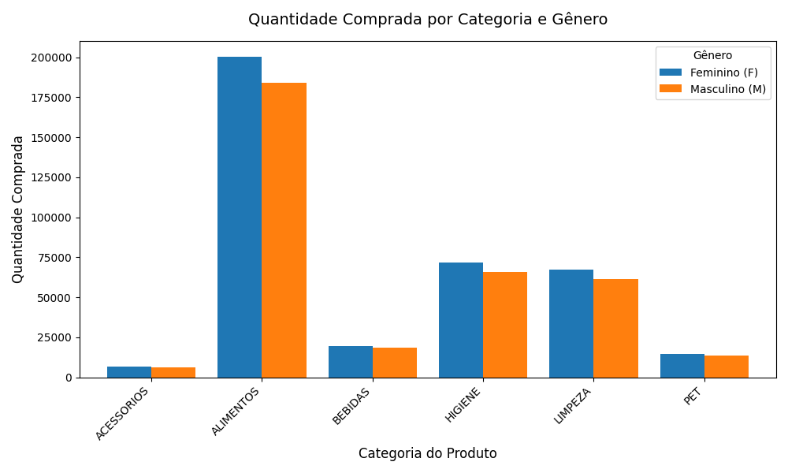

# Mini-projeto Avaliativo   

```
Análise de dados com Python [T1]
Mini-projeto avaliativo módulo 1 - semana 07
```

## Projeto e Contexto   

Este repositório é referente ao desenvolvimento da atividade do Mini-projeto do curso de Análise de Dados com Python - SCtec.   
Tem como objetivo aplicação de operações de ETL utilizando python e suas bibliotecas de manipulação de dados.   
O script desenvolvido carrega os dados de uma base csv, realiza limpeza e normalização dos dados. No final apresenta sumário dos dados e alguns insights.


## Instruções    

Seguir as instruções do arquivo [Mini projeto](./mini_projeto.md).  


## Dicionário de dados    

- Data: data da compra.
- CO_ID: Identificação do número da compra (número da nota fiscal).   
- CL_ID: Identificação do cliente (número do cliente).   
- CL_GENERO: Sexo biológico informado pelo cliente.  
- CL_EC: Estado civil do cliente: 
    - 1: Casado ou união estável
    - 2: Divorciado
    - 3: Seprado
    - 4: Solteiro
    - 5: Viúvo
- CL_FHL: Número de filhos do cliente
- CL_SEG: Segmentação econômica do cliente (Classe A, B ou C)
- PR_ID: Código do produco (SKU) adquirido
- PR_CAT: Categoria do produto adquirido
- PR_NOME: Nome do produto adquirido

## Desenvolvimento do projeto   

### Sprint 1 

Versão do python utilizada: Python 3.8.10   
Sistema Operacional: Ubuntu 20.04   

> Sprint 1 (Importação dos dados): Realização da importação dos dados na plataforma Kaggle para a IDE VsCode ou Colab, onde  o script  será executado.

- [x] Criar estrutura do projeto
    - [x] Pasta database
    - [x] Pasta src
- [x] Download do arquivo indicado no documento de especificações do projeto. https://www.kaggle.com/datasets/namespaiva/base-varejo/data    
- [x] Descompactar a base de dados e normalizar o nome do arquivo de Base Varejo.csv para base_varejo.csv (removido arquivo .zip para não poluir)
- [x] Criar Virtual Environment
    - [x] python3 -m venv Miniprojeto
    - [x] source Miniprojeto/bin/active
    - [x] instalar pandas: pip3 install pandas
    - [x] freeze nas dependencias - aumentar a segurança contra chain attack: pip3 freeze > requirements.txt
    - [x] adicionado pasta Miniprojeto ao gitignore


## Sprint 2  

> Sprint 2 (Transformação de Strings, Integer e Float e Datetime): Desenvolvimento das funções de limpeza de texto, inteiros e decimais usando métodos e expressões regulares.

- Divisão de responsábilidades dentro do arquivo, criando funções para carregar os dados

- [x] Criar função para carregar os dados do arquivo CSV, base de dados do sistema. 
- [x] Transformação dos dados
  - [x] Converter campo de data - Existe somente um campo do tipo de data, DATA, convertido para datetime
  - [x] Limpeza e transformação de strings - remoção dos espaços em branco e normalizando para uppercase
  - [x] Transformação dos inteiros - verificando se existe alguma dado nas colunas de inteiro que não seja número, se encontrado marcando como NaN
  - [ ] ~~Transformação dos decimais~~ não existem números decimais. Tarefa não será realizada.


## Sprint 3 - Limpeza de Nulos e Duplicatas   

> Aplicação das condicionais e funções para identificação e substituição de valores vazios e de str para valores de data tipo datetime, na tabela de varejo.


- [x] Funções para limpeza de dados
  - [x] Remoção de colunas inválidas - **remover_colunas_vazias**. Ao carregar os dados utilizando pandas, são apontadas 14 colunas mas a base só possui 10 colunas nas definições dedados. Removidas as colunas vazias.
  - [x] Remoção das registros duplicados - **verificar_e_remover_duplicatas**. Função que verifica os registros duplicados, após verificar se existem dados duplicados é realizada copia dos dados para futura análise e depois remoção dos dados.
  - [x] Verificação e remoção de dados nulos.
  - [x] Tranformações de dados inválidos ou vazios. - acrescentar validações de dados.
  - [x] Gerar csv com os dados limpos

## Sprint 4 - Estatística Descritiva

> Aplicação das funções estatísticas para coletar parâmetros da coluna de Número de filhos do cliente

- [x] Gerar estatísticas descritivas básicas para coluna de número de filhos do cliente (média; mediana; desvio padrão; moda; máximo; mínimo; e contagem, quartis)

Foram geradas os agrupamentos por: 
- Genêro e categoria
- Itens por nota fiscal
- Top 10 produtos mais comprados

Os resultados gerados pelos agrupamentos foram.

**Resultado da análise da coluna número de filhos**

| Campo      | Valor |
| ---------- | ----- |
| media      | 1.15  |
| mediana    | 0.0   |
| moda       | 0     |
| minimo     | 0     |
| maximo     | 4     |
| quartil_25 | 0.0   |
| quartil_75 | 2.0   |


- Resultado do agrupamento de gênero e categoria de compra:    

| CL_GENERO | PR_CAT     | Quantidade_Comprada |
| --------- | ---------- | ------------------- |
| F         | ACESSORIOS | 6839                |
| F         | ALIMENTOS  | 200274              |
| F         | BEBIDAS    | 19764               |
| F         | HIGIENE    | 71721               |
| F         | LIMPEZA    | 67328               |
| F         | PET        | 14809               |
| M         | ACESSORIOS | 6032                |
| M         | ALIMENTOS  | 183923              |
| M         | BEBIDAS    | 18500               |
| M         | HIGIENE    | 65981               |
| M         | LIMPEZA    | 61304               |
| M         | PET        | 13744               |

- Resultado do agrupamento de itens por nota:

| CO_ID | Qtd_Itens |
| ----- | --------- |
| 1000  | 46        |
| 1040  | 15        |
| 1078  | 62        |
| 1082  | 62        |
| 1103  | 5         |
| ...   | ...       |
| 919655| 67        |
| 919682| 48        |
| 919716| 64        |
| 919770| 58        |
| 919822| 58        |


- Resultado do agrupamento dos produtos mais comprados:

| ID  | PR_NOME              | Quantidade |
| --- | -------------------- | ---------- |
| 84  | PRESUNTO COZIDO      | 12719      |
| 107 | SARDINHA             | 6610       |
| 16  | BANANA               | 6518       |
| 41  | ESCOVA DE DENTE      | 6518       |
| 47  | GEL                  | 6517       |
| 80  | PAPINHA INFANTIL     | 6515       |
| 71  | MODELADOR            | 6505       |
| 25  | CERA                 | 6502       |
| 63  | LIMPADOR PERFUMADO   | 6501       |
| 23  | CEBOLA               | 6501       |

## Sprint 5 - Relatório e Documentação   

> Construção dos contadores do relatório final exibido no terminal, finalização do README.md com a reflexão teórica e submissão do link no AVA.   

Modificado métodos para retornar valores da base de dados e também resultados de transformações, desta forma foi possível gerar um sumário ao final da execução do sistema.

## Relatório e insights  

Durante a fase de transformações e limpeza de dados foi possível verificar que a base de dados possuia diversos problemas que poderiam causar distorções nas métricas para o cliente, desta forma a limpeza, transformação e normalização se provou essencial para o desenvolvimento das atividades.   

Durante este processo foram detecdados: 
- Não ocorreu erro com os registros de valores númericos.
- Existencia de colunas sem valores e nomeclatura, que foram removidas: ['Unnamed: 10', 'Unnamed: 11', 'Unnamed: 12', 'Unnamed: 13']
- Registros duplicados em um total de: 96131
- Existencia de registros inválidos na base, no valor de #N/D, em um total de 3650. Isso requer atenção pois pode ser uma falha no sistema que está gravando os dados (PDV) ou no processo de extração.  

**Principais insights**    

Obs: Os insights são relacionados aos dados apresentados e devido a restrições, atuais, de conhecimento da linguagem Python.

- Com os dados é possível verificar que a média de filhos dos clientes é de 1.15, podendo indicar que muitos clientes possuem filhos, mas devido ao valor da moda ter ficado em zero é possível que os clientes não declarem filhos ou não possuam. Para melhor determinar essa informação seria necessário necessário cruzamento de dados por categoria/nome de produto, dependendo da idade dos filhos.   
- Possível classificar os TOP 10 produtos de venda, sendo o presunto cozido o de maior quantidade.    
- Foi possível ter uma média de quantidade de itens por compra de cada cliente.    
- É possível verificar que homens e mulheres mantém próximos perfis de compra, em relação as categorias (imagem abaixo).  


